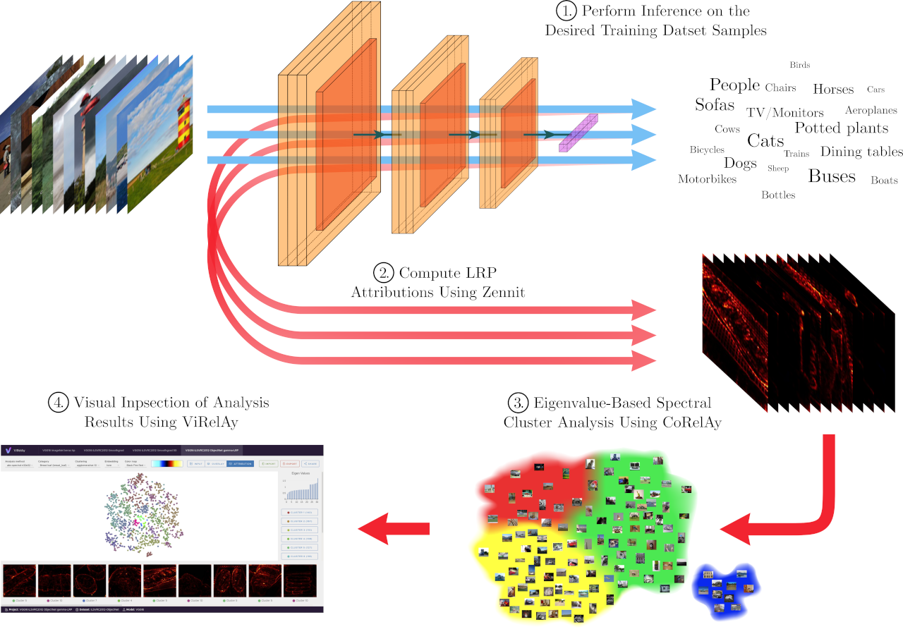

===============
Example Project
===============

In this section, we will build a more elaborate example project, which demonstrates one of the main usage scenarios of CoRelAy: the creation of a Spectral Relevance Analysis (SpRAy) :cite:p:`lapuschkin2019spray` pipeline with the goal of analyzing attributions of model predictions generated using tools like `Zennit <https://github.com/chr5tphr/zennit>`_ and visualizing the results in `ViRelAy <https://github.com/virelay/virelay>`_.

Introduction
============

To gain insights into how machine learning models make predictions, explainable artificial intelligence (XAI) methods are used to provide transparency into their decision-making processes. There are two types: Local XAI provides insights into individual predictions, while Global XAI offers a general understanding of a machine learning model. However, both types have limitations and may suffer from human bias. Local XAI is time-consuming when analyzing large datasets, while Global XAI can only measure expected features or effects. SpRAy is a technique that bridges the gap by automating the analysis of local explanations for large datasets.

Zennit is a Python framework for generating local explanations of machine learning models using PyTorch. It provides a unified interface for various XAI methods, such as saliency maps, SmoothGrad, and Deep Taylor Decomposition, but it has a strong focus on Layer-wise Relevance Propagation (LRP) :cite:p:`bach2015pixel,montavon2019layer`. Zennit can be used to generate the attributions for model predictions, that are then analyzed in a SpRAy pipeline using CoRelAy. For more information about Zennit, please refer to the `Zennit documentation <https://zennit.readthedocs.io/en/latest>`_.

ViRelAy is an XAI visualization tool, that can be used for the visual inspection and analysis of the results of SpRAy pipelines. It runs a small web application to view, explore, and interact with the source data, its attributions, clusterings, and embeddings. ViRelAy is designed to simplify the analysis of classifiers and their underlying datasets. If you want to find out more about ViRelAy, please refer to the `ViRelAy documentation <https://virelay.readthedocs.io/en/latest>`_.

The SpRAy workflow involves four key steps:

1. **Model Inference** -- The model is run on all relevant training samples, generating predictions for each.
2. **Explain Model Decisions** -- Suitable LRP variants are used to generate attributions and heatmaps for each sample and class in Zennit, providing insights into the model's decision-making process.
3. **Spectral Analysis** -- An eigenvalue-based cluster analysis identifies different prediction strategies within the data using CoRelAy.
4. **Visualization & Analysis** -- The resulting embeddings and clusterings are visualized in ViRelAy to identify anomalous behavior or potential biases in the model, enabling improvements to be made.

    Figure 1: The SpRAy workflow including the generation of attributions using Zennit, the clustering of the attributions using CoRelAy, and the visualization of the results using ViRelAy.

Loading the Data
================

In this example project, we will assume that the first two steps, model inference and explaining the model decisions, have already taken place and we will focus on the third step, the spectral analysis of the attributions generated by Zennit. For more information on how to use Zennit to generate attributions, please refer to the `tutorial <https://zennit.readthedocs.io/en/latest/tutorial/image-classification-vgg-resnet.html>`_ in the Zennit documentation. Also, please refer to the `example project <https://virelay.readthedocs.io/en/latest/getting-started/example-project.html>`_, as well as the `database specification <https://virelay.readthedocs.io/en/latest/contributors-guide/database-specification.html>`_ in the ViRelAy documentation to learn how to generate the correct database structure for the SpRAy pipeline. As a shortcut, this documentation also includes an :repo:`example script <docs/examples/hdf5_structure.py>` that randomly generates a dataset, attributions, and spectral analyses database, which can be used to test the SpRAy pipeline and visualize the results in ViRelAy.

To complete this example project, you will need an attribution database, which is an HDF5 file containing the attributions generated by Zennit. We cannot go into detail on how attribution databases are structured, but at a very basic level, the database contains an HDF5 dataset called ``attribution`` of shape `(number_of_samples, number_of_channels, height, width)`, which contains the attribution maps for all analyzed dataset samples, and an HDF5 dataset called ``label`` of shape `(number_of_samples,)`, which contains the labels of the samples. Additionally, a label map file is required, which is a JSON file that maps the label indices to their corresponding class names and optionally to WordNet synset IDs. For example, the following listing shows an excerpt from a label map file for the CIFAR-10 dataset:

.. code-block:: json

    [
        {
            "index": 0,
            "word_net_id": "n02691156",
            "name": "Airplane"
        },
        {
            "index": 1,
            "word_net_id": "n02958343",
            "name": "Automobile"
        },
        {
            "index": 2,
            "word_net_id": "n01503061",
            "name": "Bird"
        },

        // [...]
    ]

Before we can start with the data analysis, the label map file and the attribution database need to be loaded. The following code snippet shows how to load the label map file and convert the information to a list of class indices, and two dictionaries that map the label indices to their corresponding class names and WordNet synset IDs, respectively. The label map file is assumed to be in the same directory as the script, but it can be placed anywhere as long as the path is correctly specified.

.. code-block:: python

    import json

    with open('label-map.json', 'r', encoding='utf-8') as label_map_file:
        label_map = json.load(label_map_file)
    class_indices = [label['index'] for label in label_map]
    wordnet_id_map = {label['index']: label['word_net_id'] for label in label_map}
    class_name_map = {label['index']: label['name'] for label in label_map}

Now, we can go on to load the attribution database. The spectral analysis is usually performed on a per-class basis, meaning that the attributions are grouped by their class labels. This is done because the goal of SpRAy is usually to analyze the classification strategies a model has learned for each class. It may, however, also be useful to, for example, group them by the prediction of the classifier, to analyze why a classifier has misclassified certain samples. The attributions can be in any order in the attribution dataset and do not necessarily have to come in the order of the labels of the dataset samples they were generated from. For this reason, we will first load the labels of the attributions, which are stored in the ``label`` HDF5 dataset. This can then be used to load the attributions for each class label independently.

.. code-block:: python

    import h5py
    import numpy

    with h5py.File('attributions.hdf5', 'r') as attributions_file:
        labels = attributions_file['label'][:]

        for class_index in class_indices:
            indices_of_samples_in_class, = numpy.nonzero(labels == class_index)
            attribution_data = attributions_file['attribution'][indices_of_samples_in_class, :]

            # Perform spectral analysis on the attribution_data for the current class_index

Spectral Cluster Analysis
=========================

Spectral cluster analysis is a clustering technique that is a based on similarity graphs. First a similarity graph, such as a *k*-nearest neighbor graph, is constructed using a distance metric, such as the euclidean distance. Then the Laplacian of the adjacency matrix of the graph is computed, which is a matrix representation of the similarity graph. The eigendecomposition of the Laplacian yields the eigenvectors and eigenvalues, which can then be used to assign cluster labels to the data points using any arbitrary clustering algorithm. In SpRAy, the clusterings can then optionally be embedded using t-SNE or UMAP to embed the results in a lower-dimensional space, which can then be visualized in ViRelAy. For a deeper understanding of spectral clustering, please refer to :cite:p:`vonLuxburg2007tutorial`.

CoRelAy already provides a pre-implemented SpRAy pipeline, which can be used to analyze the attributions generated by Zennit. The pipeline is implemented in the :py:class:`~corelay.pipeline.spectral.SpectralClustering` class. The pipeline comprises the following 7 tasks:

1. :py:attr:`~corelay.pipeline.spectral.SpectralEmbedding.preprocessing` -- A pre-processing task, which can be used to apply any custom function to the data before the spectral analysis, e.g., rescaling the annotations or folding multi-channel relevances into a single channel. By default, it applies a no-op function, which does not change the data.
2. :py:attr:`~corelay.pipeline.spectral.SpectralEmbedding.pairwise_distance` -- A task, which computes the pairwise distance matrix of the input data. By default, it uses the euclidean distance metric, but it can be customized to use any other distance metric.
3. :py:attr:`~corelay.pipeline.spectral.SpectralEmbedding.affinity` --  An affinity task, which computes the affinity matrix from the pairwise distance matrix. By default, it uses a sparse *k*-nearest neighbors graph with 10 neighbors, but it can be customized to use any other affinity algorithm.
4. :py:attr:`~corelay.pipeline.spectral.SpectralEmbedding.laplacian` -- The graph laplacian function that is applied to the affinity matrix. The task defaults to a symmetric normal laplacian, but it can be changed to another Laplacian, like the random walk normal Laplacian function.
5. :py:attr:`~corelay.pipeline.spectral.SpectralEmbedding.embedding` -- The embedding function to be applied to the graph laplacian. Defaults to an eigendecomposition with 32 eigenvalues.
6. :py:attr:`~corelay.pipeline.spectral.SpectralClustering.select_eigenvector` -- This task is used to select the eigenvectors from the output of the spectral embedding. Since the spectral embedding task returns a tuple containing the eigenvalues first and eigenvectors second, it defaults to the second output of the spectral embedding, but if a custom embedding function is used, it can be customized to select the appropriate output.
7. :py:attr:`~corelay.pipeline.spectral.SpectralClustering.clustering` -- A clustering algorithm that is to be applied to the spectral embedding. It defaults to *k*-Means clustering with 2 clusters, but it can be customized to use any other clustering algorithm, such as DBSCAN, HDBSCAN, or agglomerative clustering. This task can also be used to embed the results of the embedding task using t-SNE or UMAP to a a lower dimensional space, which can then be visualized in ViRelAy.

.. note::

    Please note, that you have to install CoRelAy with HDBSCAN and UMAP support if you want to use HDBSCAN as a clustering algorithm or UMAP as a dimensionality reduction algorithm. This can be done by installing CoRelAy with the ``[hdbscan,umap]`` extra, e.g., using the following command:

    .. code-block:: shell

        pip install corelay[hdbscan,umap]

So, to perform the spectral analysis of the attributions, we can simply create an instance of the :py:class:`~corelay.pipeline.spectral.SpectralClustering` class and run it on the attribution data for each class. The following code snippet shows how to do this:

.. code-block:: python

    from typing import Any

    import h5py
    import numpy

    from corelay.pipeline.spectral import SpectralClustering

    pipeline = SpectralClustering()

    with h5py.File('attributions.hdf5', 'r') as attributions_file:
        labels = attributions_file['label'][:]

        for class_index in class_indices:
            indices_of_samples_in_class, = numpy.nonzero(labels == class_index)
            attribution_data = attributions_file['attribution'][indices_of_samples_in_class, :]

            (eigenvalues, eigenvectors), spectral_clustering = pipeline(attribution_data)

Depending on the input data, it may, however, be necessary to pre-process the data before running the spectral analysis. For example, the data may be normalized and the array flattened to remove the channel, height, and width dimensions. This is a great opportunity to create some custom processors that can be used to pre-process the data before the spectral analysis. The following code snippet shows a processor that normalizes the data and a processor that flattens the data:

.. code-block:: python

    from collections.abc import Sequence
    from typing import Annotated, Any, SupportsIndex

    import numpy

    from corelay.base import Param
    from corelay.processor.base import Processor

    class Flatten(Processor):
        def function(self, data: Any) -> Any:
            input_data: numpy.ndarray[Any, Any] = data
            return input_data.reshape(input_data.shape[0], numpy.prod(input_data.shape[1:]))

    class Normalize(Processor):
        axes: Annotated[SupportsIndex | Sequence[SupportsIndex], Param((SupportsIndex, Sequence), (1, 2))]

        def function(self, data: Any) -> Any:
            input_data: numpy.ndarray[Any, Any] = data
            return input_data / input_data.sum(self.axes, keepdims=True)

Now, we can use these processors in the spectral clustering pipeline to customize the pre-processing of the data. We will also customize the clustering algorithm used to cluster the spectral embedding: Since it is often not known in advance how many clusters are present in the data, we will compute multiple *k*-Means clusterings with different numbers of clusters. These can all be visualized in ViRelAy, which allows us to explore the data and find the optimal number of clusters. Also, the spectral embeddings are usually high-dimensional, which renders a visualization of all dimensions at the same time impossible. For this reason, we will use dimensionality reduction techniques to embed the spectral embeddings in a 2-dimensional space. Depending on the input data, sometimes t-SNE is better for finding defects in the classifier and/or dataset, while other times UMAP can be more informative. Therefore, we will compute both t-SNE and UMAP embeddings of the spectral embeddings. The following code snippet shows how to set up the spectral clustering pipeline with the custom processors and the customized clustering algorithms:

.. code-block:: python

    from corelay.pipeline.spectral import SpectralClustering
    from corelay.processor.clustering import KMeans
    from corelay.processor.embedding import TSNEEmbedding, UMAPEmbedding
    from corelay.processor.flow import Sequential, Parallel

    pipeline = SpectralClustering(
        preprocessing=Sequential([
            Normalize(axes=(1, 2, 3)),
            Flatten()
        ]),
        clustering=Parallel([
            Parallel([KMeans(n_clusters=number_of_clusters) for number_of_clusters in [2, 3, 4, 5]], broadcast=True),
            UMAPEmbedding(),
            TSNEEmbedding()
        ], broadcast=True, is_output=True)
    )

    (eigenvalues, eigenvectors), (kmeans, umap, tsne) = pipeline(attribution_data)

The :py:class:`~corelay.processor.flow.Sequential` and :py:class:`~corelay.processor.flow.Parallel` processors are used to direct the flow of data through the pipeline. They are sequential and parallel in the sense of data, not in the sense of execution. This means that :py:class:`~corelay.processor.flow.Sequential` will feed its input data to the first processor in the sequence, and the output of that processor will be fed to the next processor, and so on. The :py:class:`~corelay.processor.flow.Parallel` processor will also execute the processors in the sequence sequentially, but it will feed the input data to all processors in the sequence. Depending on whether the :py:attr:`~corelay.processor.flow.Parallel.broadcast` parameter is set to :py:obj:`True` or :py:obj:`False`, the :py:class:`~corelay.processor.flow.Parallel` processor will either treat its input as an array of inputs to its sub-processors, or it will broadcast its input to all sub-processors, i.e., the :py:class:`~corelay.processor.clustering.KMeans`, :py:class:`~corelay.processor.embedding.UMAPEmbedding`, and :py:class:`~corelay.processor.embedding.TSNEEmbedding` processors assigned to the :py:attr:`~corelay.pipeline.spectral.SpectralClustering.clustering` task in the pipeline will all receive the same array of eigenvectors as input, that were selected by the :py:attr:`~corelay.pipeline.spectral.SpectralClustering.select_eigenvector` task.

The :py:attr:`~corelay.processor.base.Processor.is_output` parameter is used to indicate whether the output of a processor should be included in the output of the pipeline. A pipeline will concatenate the outputs of all processors that have the :py:attr:`~corelay.processor.base.Processor.is_output` parameter set to :py:obj:`True` into a tuple an return it. Please note that processors in turn may also return tuples, which will result in a nested tuple structure. For example, the :py:class:`~corelay.processor.flow.Sequential` and :py:class:`~corelay.processor.flow.Parallel` processors will return a tuple containing the outputs of all of their sub-processors. The :py:class:`~corelay.pipeline.spectral.SpectralClustering` pipeline has set the default processors of the :py:attr:`~corelay.pipeline.spectral.SpectralEmbedding.embedding` and :py:attr:`~corelay.pipeline.spectral.SpectralClustering.clustering` tasks to have the :py:attr:`~corelay.processor.base.Processor.is_output` parameter set to :py:obj:`True`.

Generating the Analysis Database
================================

Now, that the spectral analysis has been performed, the results can be stored in a database. Again, we will not go into detail on how the database is structured. For more information, please refer to the `database specification <https://virelay.readthedocs.io/en/latest/contributors-guide/database-specification.html>`_ in the ViRelAy documentation. For now, it suffices to know, that the database is an HDF5 file, which contains HDF5 groups for each analysis that was performed. The names of the analysis groups can be chosen arbitrarily, but it is common to use the class name of the class the analysis was performed on. Each analysis group contains an HDF5 dataset called ``index``, which contains the indices of the dataset samples whose corresponding attributions were analyzed. Furthermore, analysis groups contain two further HDF5 sub-groups: The ``embedding`` group, which contains the embeddings produced by the analysis, and the ``clustering`` group, which contains the clusterings produced by the analysis.

Each entry in the embedding group is an HDF5 dataset that contains the embedding data. The name of the dataset can be chosen arbitrarily, but it is common to use the name of the embedding method, such as ``tsne``, or the name of the embedding method and a relevant parameter of the embedding algorithm, such as the number of components used in the t-SNE embedding, e.g., ``tsne-2``. It can have additional attributes to further describe the embedding data: The ``eigenvalue`` attribute is a dataset that contains the eigenvalues of the spectral embedding and the ``embedding`` attribute is a string that contains the name of the embedding on which this embedding was based (e.g., the t-SNE embedding in this project is based on the spectral embedding).

Although, the clustering group differs in the details of its make up, it has the same basic structure as the embedding group. It contains HDF5 datasets for each clustering that was performed, which are named after the clustering algorithm and the number of clusters used in the clustering, e.g., ``kmeans-2`` for a *k*-Means clustering with 2 clusters. The datasets can have additional attributes to further describe the clustering data: The ``embedding`` attribute is a string that contains the name of the embedding on which this clustering was based (e.g., the *k*-Means clustering in this project is based on the spectral embedding).

The following code listing shows how to generate the analysis database from the results of the spectral analysis pipeline:

.. code-block:: python

    import h5py
    import numpy

    (eigenvalues, eigenvectors), (kmeans, (umap, tsne)) = pipeline(attribution_data)

    with h5py.File('analysis.hdf5', 'a') as analysis_file:

        # The name of the analysis is the name of the class
        analysis_name = wordnet_id_map.get(class_index, f'{class_index:08d}')

        # Adds the indices of the samples in the current class to the analysis database
        analysis_group = analysis_file.require_group(analysis_name)
        analysis_group['index'] = indices_of_samples_in_class.astype(numpy.uint32)

        # Adds the spectral embedding to the analysis database
        embedding_group = analysis_group.require_group('embedding')
        embedding_group['spectral'] = eigenvectors.astype(numpy.float32)
        embedding_group['spectral'].attrs['eigenvalue'] = eigenvalues.astype(numpy.float32)

        # Adds the UMAP embedding to the analysis database
        embedding_group['umap'] = umap.astype(numpy.float32)
        embedding_group['umap'].attrs['embedding'] = 'spectral'

        # Adds the t-SNE embedding to the analysis database
        embedding_group['tsne'] = tsne.astype(numpy.float32)
        embedding_group['tsne'].attrs['embedding'] = 'spectral'

        # Adds the k-means clustering of the embeddings to the analysis database
        cluster_group = analysis_group.require_group('cluster')
        for number_of_clusters, clustering in zip(number_of_clusters_list, kmeans):
            clustering_dataset_name = f'kmeans-{number_of_clusters:02d}'
            cluster_group[clustering_dataset_name] = clustering
            cluster_group[clustering_dataset_name].attrs['embedding'] = 'spectral'

Putting it All Together
=======================

Now, we can put everything together in a single script that loads the label map file and the attribution database, performs the spectral analysis on the attributions, and generates the analysis database. The following code listing shows how to do this:

.. code-block:: python

    import json
    from collections.abc import Sequence
    from typing import Annotated, Any, SupportsIndex
    from typing import Any

    import h5py
    import numpy

    from corelay.base import Param
    from corelay.pipeline.spectral import SpectralClustering
    from corelay.processor.base import Processor
    from corelay.processor.clustering import KMeans
    from corelay.processor.embedding import TSNEEmbedding, UMAPEmbedding
    from corelay.processor.flow import Sequential, Parallel

    class Flatten(Processor):
        def function(self, data: Any) -> Any:
            input_data: numpy.ndarray[Any, Any] = data
            return input_data.reshape(input_data.shape[0], numpy.prod(input_data.shape[1:]))

    class Normalize(Processor):
        axes: Annotated[SupportsIndex | Sequence[SupportsIndex], Param((SupportsIndex, Sequence), (1, 2))]

        def function(self, data: Any) -> Any:
            input_data: numpy.ndarray[Any, Any] = data
            return input_data / input_data.sum(self.axes, keepdims=True)

    pipeline = SpectralClustering(
        preprocessing=Sequential([
            Normalize(axes=(1, 2, 3)),
            Flatten()
        ]),
        clustering=Parallel([
            Parallel([KMeans(n_clusters=number_of_clusters) for number_of_clusters in [2, 3, 4, 5]], broadcast=True),
            UMAPEmbedding(),
            TSNEEmbedding()
        ], broadcast=True, is_output=True)
    )

    with open('label-map.json', 'r', encoding='utf-8') as label_map_file:
        label_map = json.load(label_map_file)
    class_indices = [label['index'] for label in label_map]
    wordnet_id_map = {label['index']: label['word_net_id'] for label in label_map}
    class_name_map = {label['index']: label['name'] for label in label_map}

    with h5py.File('attributions.hdf5', 'r') as attributions_file:
        labels = attributions_file['label'][:]

        for class_index in class_indices:
            indices_of_samples_in_class, = numpy.nonzero(labels == class_index)
            attribution_data = attributions_file['attribution'][indices_of_samples_in_class, :]

        (eigenvalues, eigenvectors), (kmeans, umap, tsne) = pipeline(attribution_data)

        with h5py.File('analysis.hdf5', 'a') as analysis_file:

            # The name of the analysis is the name of the class
            analysis_name = wordnet_id_map.get(class_index, f'{class_index:08d}')

            # Adds the indices of the samples in the current class to the analysis database
            analysis_group = analysis_file.require_group(analysis_name)
            analysis_group['index'] = indices_of_samples_in_class.astype(numpy.uint32)

            # Adds the spectral embedding to the analysis database
            embedding_group = analysis_group.require_group('embedding')
            embedding_group['spectral'] = eigenvectors.astype(numpy.float32)
            embedding_group['spectral'].attrs['eigenvalue'] = eigenvalues.astype(numpy.float32)

            # Adds the UMAP embedding to the analysis database
            embedding_group['umap'] = umap.astype(numpy.float32)
            embedding_group['umap'].attrs['embedding'] = 'spectral'

            # Adds the t-SNE embedding to the analysis database
            embedding_group['tsne'] = tsne.astype(numpy.float32)
            embedding_group['tsne'].attrs['embedding'] = 'spectral'

            # Adds the k-means clustering of the embeddings to the analysis database
            cluster_group = analysis_group.require_group('cluster')
            for number_of_clusters, clustering in zip(number_of_clusters_list, kmeans):
                clustering_dataset_name = f'kmeans-{number_of_clusters:02d}'
                cluster_group[clustering_dataset_name] = clustering
                cluster_group[clustering_dataset_name].attrs['embedding'] = 'spectral'

The resulting ``analysis.hdf5`` file can then be used to visualize the results in ViRelAy. To do this, you need to create a ViRelAy project file. To find out how to do this, please refer to the `project file format specification <https://virelay.readthedocs.io/en/latest/contributors-guide/project-file-format.html>`_ in the ViRelAy documentation. Also, the `example project <https://virelay.readthedocs.io/en/latest/getting-started/example-project.html>`_ in the ViRelAy documentation contains more information on how to create a ViRelAy project.

The example project that was presented in this section is a simplified version of the SpRAy pipeline script that is included in the examples directory of the CoRelAy repository, which can be found at :repo:`docs/examples/virelay_analysis.py`.
